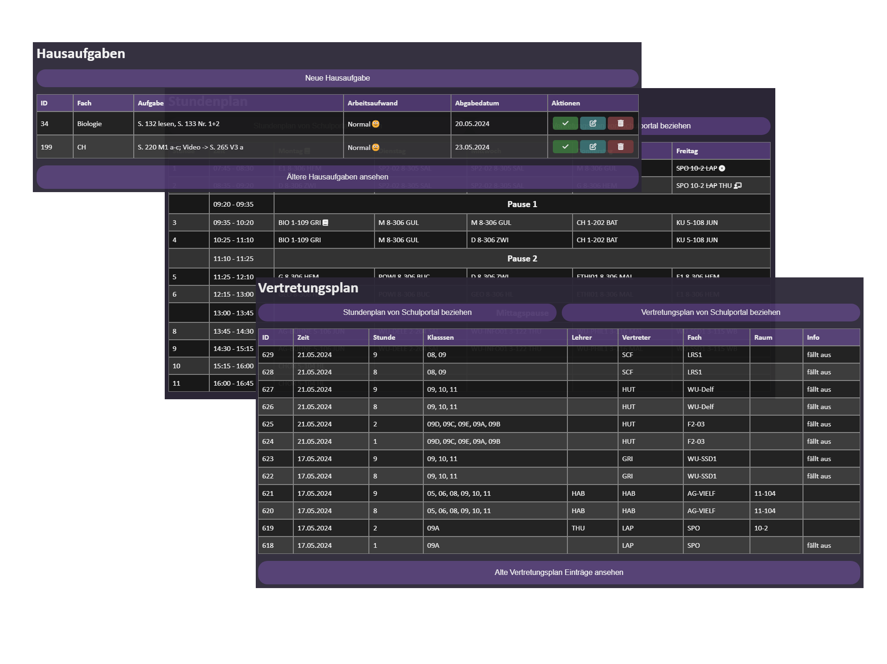
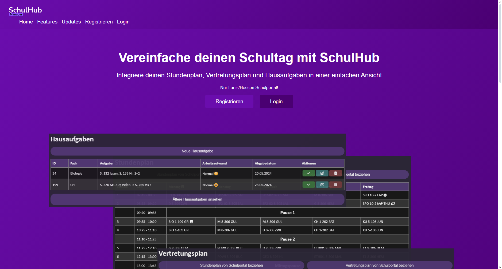
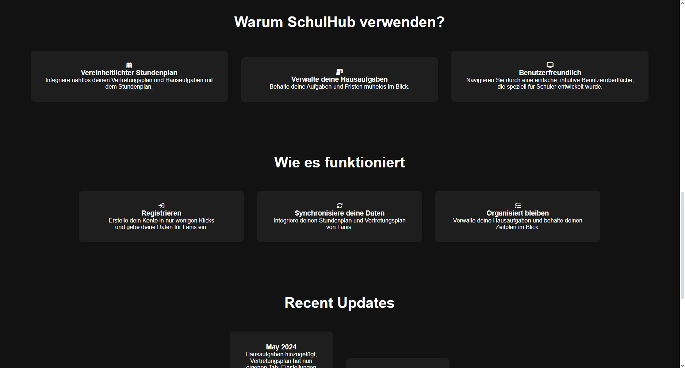
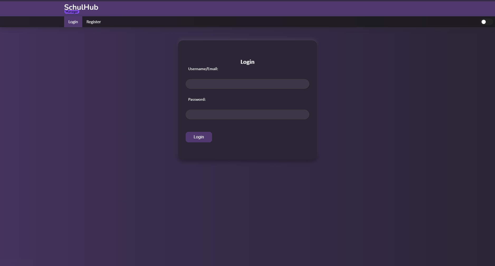
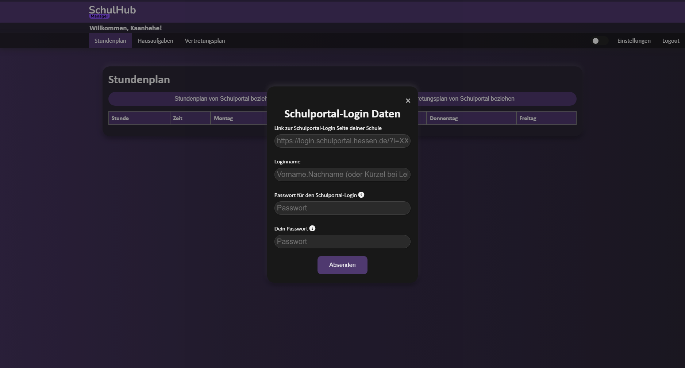

# School Manager

School Manager is a web application designed to help manage school-related tasks such as timetables, homework, and replacement plans. The application is built using Python and Flask for the backend, and HTML, CSS, and JavaScript for the frontend.







## Table of Contents

- [Installation](#installation)
- [Usage](#usage)
- [Features](#features)
- [Contributing](#contributing)
- [License](#license)

## Installation

This project was build using Heroku and may needs to be modified to be used without it, the database was also hosted on Heroku using the Heroku Postgres add-on

1. Clone the repository:
    ```sh
    git clone https://github.com/kaanhehe/school-manager.git
    cd school-manager
    ```

2. Create a virtual environment and activate it:
    ```sh
    python -m venv .env
    source .env/bin/activate  # On Windows use `.env\Scripts\activate`
    ```

3. Install the required dependencies:
    ```sh
    pip install -r requirements.txt
    ```

4. Set up the database:
    ```sh
    python createTables.py
    ```

## Usage

1. Run the application:
    ```sh
    flask run
    ```

2. Open your web browser and go to `http://127.0.0.1:5000`.

## Features

- **Automatically Webscraping**: Takes all data from your school website automatically.
- **Timetable Management**: View and manage your school timetable.
- **Homework Management**: Add, edit, and delete homework assignments.
- **Replacement Plan**: View your replacement plan.
- **Combined into Timetable**: Homework and Replacement plan is integrated into the Timetable.
- **Security**: All passwords are encrypted to ensure your school website login is secured.

## Contributing
Contributions are welcome! Please fork the repository and submit a pull request for any improvements or bug fixes.

## License
This project is licensed under the MIT License. See the LICENSE file for details.